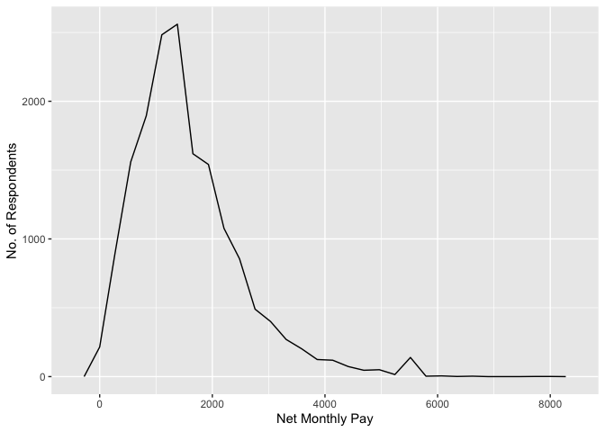
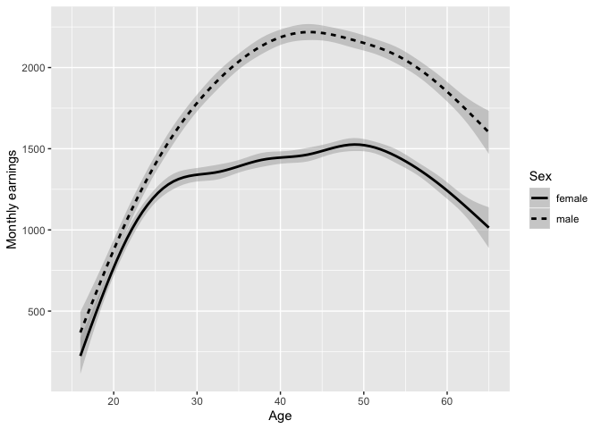
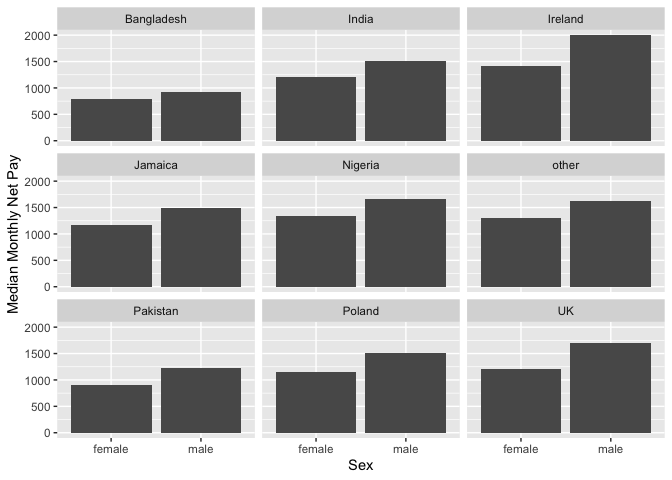
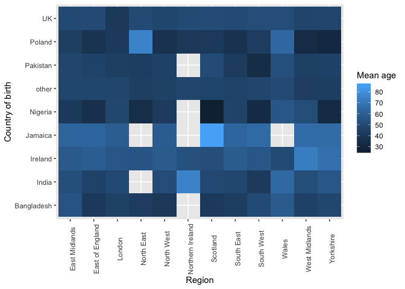
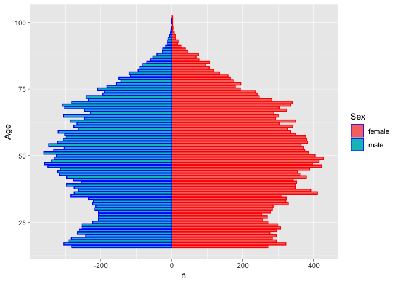

Statistical assignment 4
================
Jessica Ledger – 660013603
26/02/2020

In this assignment you will need to reproduce 5 ggplot graphs. I supply
graphs as images; you need to write the ggplot2 code to reproduce them
and knit and submit a Markdown document with the reproduced graphs (as
well as your .Rmd file).

First we will need to open and recode the data. I supply the code for
this; you only need to change the file paths.

    ```r
    library(tidyverse)
    Data8 <- read_tsv("/Users/jessicaledger/Desktop/WORK/THIRD YEAR/Data Analysis III/data2020/data/UKDA-6614-tab/tab/ukhls_w8/h_indresp.tab")
    
    Data8 <- Data8 %>%
        select(pidp, h_age_dv, h_payn_dv, h_gor_dv)
    
    Stable <- read_tsv("/Users/jessicaledger/Desktop/WORK/THIRD YEAR/Data Analysis III/data2020/data/UKDA-6614-tab/tab/ukhls_wx/xwavedat.tab")
    
    Stable <- Stable %>%
        select(pidp, sex_dv, ukborn, plbornc)
    
    Data <- Data8 %>% left_join(Stable, "pidp")
    rm(Data8, Stable)
    
    Data <- Data %>%
        mutate(sex_dv = ifelse(sex_dv == 1, "male",
                           ifelse(sex_dv == 2, "female", NA))) %>%
        mutate(h_payn_dv = ifelse(h_payn_dv < 0, NA, h_payn_dv)) %>%
        mutate(h_gor_dv = recode(h_gor_dv,
                         `-9` = NA_character_,
                         `1` = "North East",
                         `2` = "North West",
                         `3` = "Yorkshire",
                         `4` = "East Midlands",
                         `5` = "West Midlands",
                         `6` = "East of England",
                         `7` = "London",
                         `8` = "South East",
                         `9` = "South West",
                         `10` = "Wales",
                         `11` = "Scotland",
                         `12` = "Northern Ireland")) %>%
        mutate(placeBorn = case_when(
                ukborn  == -9 ~ NA_character_,
                ukborn < 5 ~ "UK",
                plbornc == 5 ~ "Ireland",
                plbornc == 18 ~ "India",
                plbornc == 19 ~ "Pakistan",
                plbornc == 20 ~ "Bangladesh",
                plbornc == 10 ~ "Poland",
                plbornc == 27 ~ "Jamaica",
                plbornc == 24 ~ "Nigeria",
                TRUE ~ "other")
        )
    ```

Reproduce the following graphs as close as you can. For each graph,
write two sentences (not more\!) describing its main message.

1.  Univariate distribution (20 points).
    
    ``` r
    Data %>%
    ggplot(mapping = aes(x = h_payn_dv)) +
      geom_freqpoly() +
      xlab("Net Monthly Pay") +
      ylab("No. of Respondents")
    ```
    
    <!-- --> This
    graph shows that, most respondents have a net pay per month of
    approximately ~£1,400. However, after this peak the net pay
    decreases quite dramatically, with a small peak at ~£5,500.

2.  Line chart (20 points). The lines show the non-parametric
    association between age and monthly earnings for men and women.
    
    ``` r
    Data %>%
    ggplot(mapping =  aes(x = h_age_dv, y = h_payn_dv, linetype = sex_dv)) +
      geom_smooth(colour = "black") +
      xlim(15, 65) +
      xlab("Age") +
      ylab("Monthly earnings")+
      labs(linetype="Sex")
    ```
    
    <!-- --> This
    graph shows that until the age of ~22 both sexes follow the same
    upward trajectory of growth in net monthly earnings. After this
    point, the growth in monthly earnings slows dramtically for women in
    comparison to men (widening the gap) and both sexes face a downward
    trajectory in monthly earnings after the age of 50.

3.  Faceted bar chart (20 points).
    
    ``` r
    BySex <- Data %>%
      group_by(sex_dv, placeBorn) %>%
      summarise(medianpay = median(h_payn_dv, na.rm = TRUE)) %>%
      filter(!is.na(sex_dv)) %>%
      filter(!is.na(placeBorn))
    
    BySex %>%
      ggplot(mapping = aes(x = sex_dv, y = medianpay)) + 
      geom_histogram(stat = "identity") +
    facet_wrap(~ placeBorn, ncol = 3) +
    ylim(0,2000) +
    xlab("Sex") +
    ylab("Median Monthly Net Pay")
    ```
    
    <!-- --> This
    chart demonstrates that in every country, men have a larger median
    net monthly pay than women. The difference in the median net monthly
    pay varies per country, the largest different is seen in Ireland and
    the smallest gap is interestingly in Bangladesh.

4.  Heat map (20 points).
    
    ``` r
    library(tidyr)
    
    ByRegion <- Data %>% 
      group_by(h_gor_dv, placeBorn) %>%
      summarise(Meanage = mean(h_age_dv, na.rm = TRUE)) %>%
      filter(!is.na(h_gor_dv)) %>%
      filter(!is.na(placeBorn))
    
    
    ByRegion %>%
      ggplot(mapping = aes(x = h_gor_dv, y = placeBorn, fill = Meanage)) +
      geom_tile() +
      xlab("Region") +
      ylab("Country of birth") +
      labs(fill = "Mean age") +
      theme(axis.text.x = element_text(angle = 90))
    ```
    
    <!-- --> This
    heat map shows the mean age of residents per region in the UK
    depending on their country of birth. The map indicates that the mean
    age across the regions is 60-70. There is a noticably low mean age
    for Nigerians in Scotland and Yorkshire bit this may be due to a
    small sample size, there are also quite a few NAs accross the map
    especially in Northern Ireland.

5.  Population pyramid (20 points).
    
    ``` r
    byPop <- Data %>%
      group_by(sex_dv, h_age_dv) %>%
      filter(!is.na(sex_dv)) %>%
      filter(!is.na(h_age_dv)) %>%
      count(sex_dv, h_age_dv)  #creates n column
    
    byPop$n <- ifelse(byPop$sex_dv == "male", -1*byPop$n, byPop$n)
    
    byPop %>%  
      ggplot(mapping = aes(x = h_age_dv, y = n, fill = sex_dv)) + 
      geom_bar(data = subset(byPop, sex_dv == "female"), stat = "identity",      colour = "red") +
      geom_bar(data = subset(byPop, sex_dv == "male"), stat = "identity", colour = "blue") + 
      coord_flip() +
      xlab("Age") +
      labs(fill = "Sex")
    ```
    
    <!-- -->
